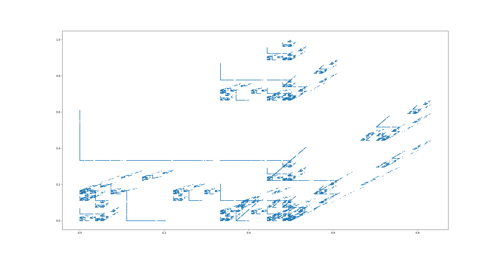
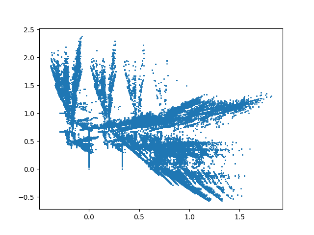

# Fractal Generator

This repository is dedicated to generating fractals using IFS (Iterated function system). The transformation of a point on the plane is described by the system:

```
x' = ax + by + c
y' = dx + ey + f
```

## Project Structure

This project already contains a few presets for interesting fractals as well as their outputs, ready to be visualized.
It also contains `matplotvisualizer.py`, which is a simple Python script that uses Matplotlib to render the fractals.
*Note : feel free to use any other visualization you want.*
## Compiling

The program can be compiled with `g++` using the make system. To compile the program, execute the following commands in the repository directory:

```bash
make
```

## Running the Program

You can run this program in the command line by using the following params (the order of params is arbitrary):

- `-i` input file with a set of n transformations in correct format:
  ```
  p1 a1 b1 c1 d1 e1 f1
  p2 a2 b2 c2 d2 e2 f2
  ...
  pn an bn cn dn en fn
  ```

- `-o` output file with fractal point coordinates.
- `-n` number of iterations (fractal depth), recommended number: (10000-1000000)

**Example:**

```bash
.\fractal_generator.exe -i .\resources\Koch_Snowflake_IN.txt -o .\resources\Koch_Snowflake_OUT.txt -n 500000
```

## Examples of Fractals Created, Visualized in Matplotlib

- Sierpinski's Carpet:
  
  
- Koch's Snowflake:
  

## Issues

If something is not clear or you have any issues with the program, please feel free to open an issue on GitHub. I appreciate your feedback and will do my best to resolve any issues as quickly as possible.